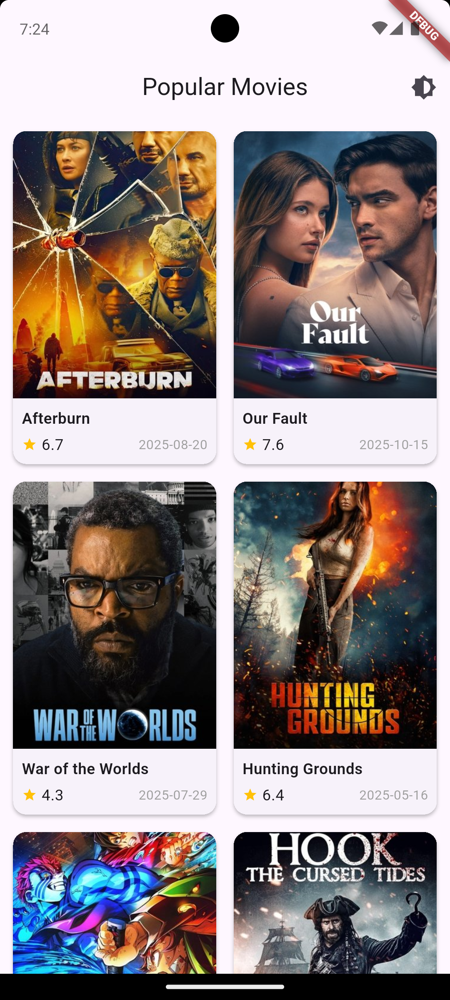
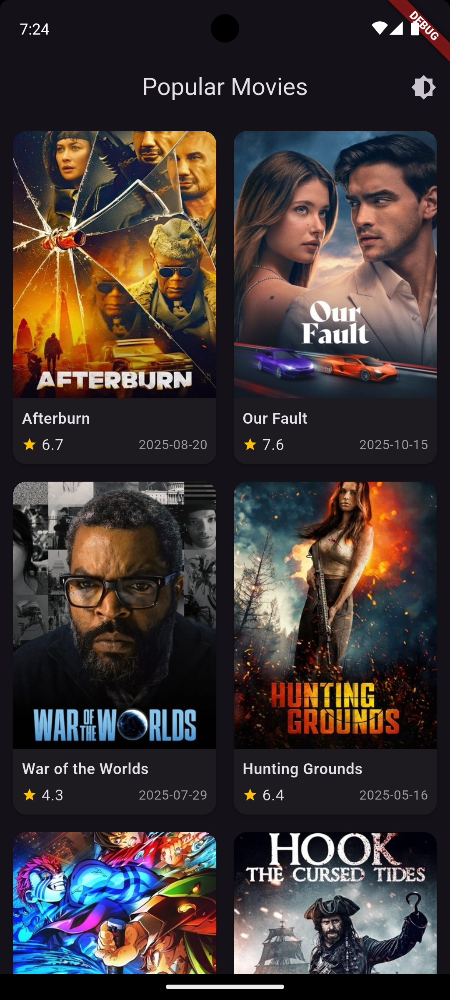
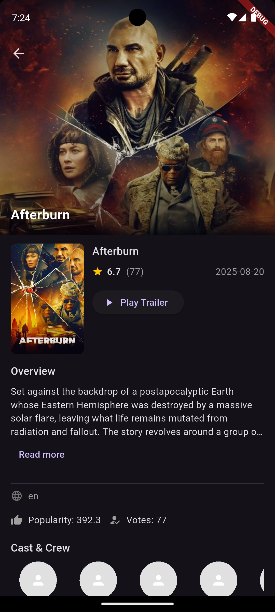

# 🎬 Week6 Task — **Movies App**

A sleek Flutter app that displays **popular movies from TMDB**, featuring **infinite scroll pagination**, **offline caching**, and **error tracking via Sentry**.  
Built with **Clean Architecture**, **BLoC (Cubit)**, **dependency injection (`get_it`)**, and a **beautiful dark/light theme** for a modern cinema-style experience.

---

## ✨ Preview
| Light Mode | Dark Mode |
|-------------|-----------|
|  |  |
|  |  |

> 📸 Store screenshots in `assets/screenshots/` and update the paths above.

---

## 🎥 Features

- 🔥 **Popular Movies Feed** — fetches from TMDB with proper pagination  
- ⚙️ **Domain-layer Pagination** — logic handled by `MoviePaginator` (keeps UI clean)  
- 💾 **Offline Cache (Hive)** — view cached pages when offline  
- 🧠 **Clean Architecture** — separation of Data / Domain / Presentation  
- 🌗 **Dynamic Theming** — dark/light toggle via `ThemeCubit`  
- 🪄 **BLoC (Cubit)** — predictable state management  
- 🚨 **Sentry Integration** — automatic crash & error reporting  
- 💬 **Snackbars & Banners** — show network or cache status  
- 🧭 **Dependency Injection** — with `get_it` service locator  
- 🎨 **Modern UI** — smooth grid layout, rich cards, consistent colors  

---

## 🧱 sentry

